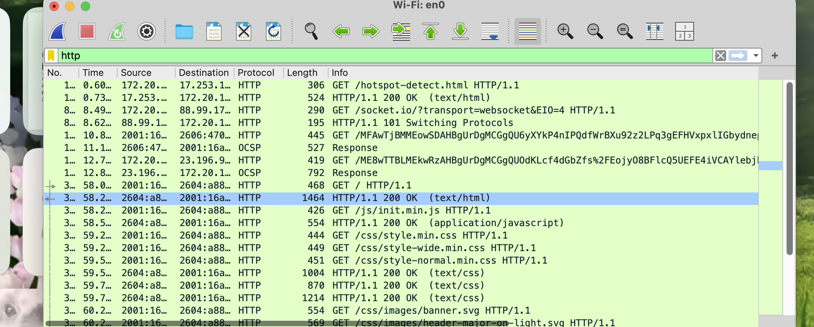
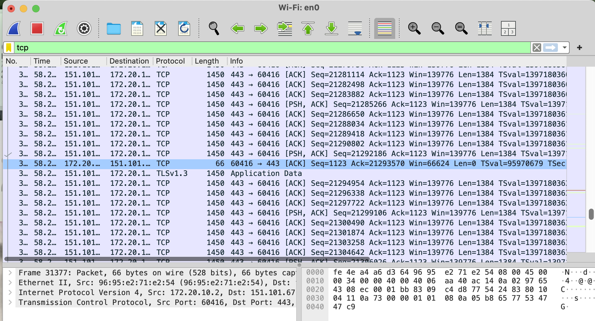

# CS471 – Web Technologies
## Lab 1: Internet Protocols

Student Name: Shada Alshayie
Course: CS471  
Lab: 1  

---

## Part 1: Capturing HTTP Traffic

### Task 1: Start Wireshark and capture packets
**Screenshot:**  
- HTTP traffic capture while visiting http://neverssl.com/

### Task 2: Filter HTTP packets and analyze them
**Screenshot:**  
- HTTP GET request and HTTP 200 OK response

---

## Part 2: Analyzing TCP/IP Traffic

### Task 1: Filter TCP packets
**Screenshot:**  
- 

### Task 2: TCP Handshake, Data Transfer, and Termination
**Screenshots:**
- TCP three-way handshake (SYN, SYN-ACK, ACK)
- Sequence and Acknowledgment numbers
- Data transfer packets
- TCP termination (FIN, ACK)

---

## Part 3: Capturing and Analyzing UDP Traffic

### Task 1: Generate UDP traffic
**Screenshot:**  
- Lab1_UDP_Packet.png
- Lab1_UDP_Packet.png

### Task 2: Filter and analyze UDP packets
**Screenshot:**  
- UDP packet details (source port, destination port, length, data)

**Note:**  
UDP has a simpler header compared to TCP and does not use sequence numbers or acknowledgments.

---

## Part 4: Comparing TCP and UDP

### Task 1: Reliability and Data Handling

| TCP or UDP | Reasons |
|-----------|---------|
| TCP | TCP is reliable and connection-oriented. It establishes a connection using a three-way handshake. |
| TCP | TCP ensures data integrity and correct ordering using sequence numbers and acknowledgments. |

### Task 2: Use Cases and Performance

|        | TCP | UDP |
|--------|-----|-----|
| Use cases | Web browsing, email, file transfer | Streaming, VoIP, gaming, DNS |
| Performance | Slower but reliable | Faster with low overhead |

---

## Instructions
- Add your screenshots in this repository.
- Name screenshots clearly (e.g., tcp_handshake.png, udp_packet.png).
- Commit and push all files to your Git repository.
